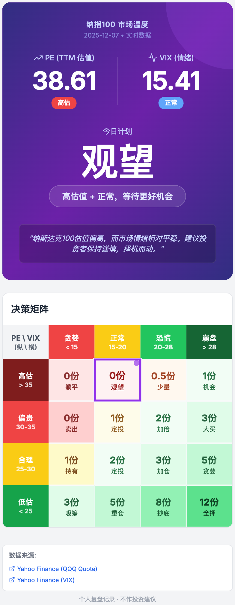

# Nasdaq-100 Thermometer

A web application to monitor and analyze the Nasdaq-100 index.

## Run Locally

### Steps
1. Install dependencies:
   ```bash
   npm install
   ```
2. Set your Gemini API key in a `.env.local` file:
   ```env
   GEMINI_API_KEY=your_gemini_api_key
   ```
3. Start the development server:
   ```bash
   npm run dev
   ```

## Preview


